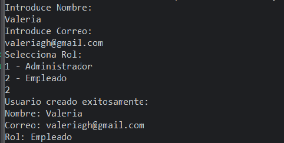

# Practica-02
## Objetivo

El objetivo de esta práctica fue aprender a organizar la estructura de directorios para facilitar la comprensión, el mantenimiento y la escalabilidad de los programas, aplicando conceptos básicos de la programación orientada a objetos.

## Descripción

A grandes rasgos, esta práctica consistió en diseñar y codificar una solución modular en Java que aplicó la encapsulación y los métodos de una clase (Usuario) bajo el control de una clase principal (Main) que se encargó de la validación interactiva de datos.
* Se utilizó la carpeta src/modulos para almacenar las clases creadas.
* La clase Usuario.java fue el núcleo de la POO, enfocándose en el principio de Encapsulamiento.
* La clase Main.java se ubicó en la raíz de src/, sirviendo como el punto de inicio de la aplicación. Así mismo, esta clase gestionó la interacción con el usuario y garantizó la validación de los datos solicitados.
* Se incluyó un archivo README.txt con el nombre completo del alumno en el directorio raíz del proyecto.

## ⚙️ Tecnologías utilizadas

* **Lenguaje:** JavaSE-24.
* **IDE:** Eclipse IDE.

## 📁 Estructura del Proyecto

El proyecto sigue la estructura jerárquica solicitada, separando la lógica de negocio (Clase `Usuario`) de la lógica de aplicación (Clase `Main`).

**Proyecto/**                   
**├── src/**                    
**│   ├── modulos/**            
**│   │   └── Usuario.java**    
**│   └── Main.java**           
**└── README.txt**              

## 📸 Evidencias (Capturas de pantalla)

A continuación se muestra la captura de pantalla de la ejecución en consola, donde se verifica el funcionamiento de las validaciones de Rol y Correo, y la correcta creación del objeto `Usuario`.

Componente	Ruta del Archivo	Descripción
Clase Usuario	src/modulos/Usuario.java	Implementa Encapsulamiento con atributos privados, constructores, getters, setters, y el método equals.
Clase Main	src/Main.java	Contiene el método main y gestiona la interacción por consola, incluyendo la validación de Rol y Correo.
Documentación	README.txt	Archivo requerido que contiene únicamente el nombre completo del alumno.

